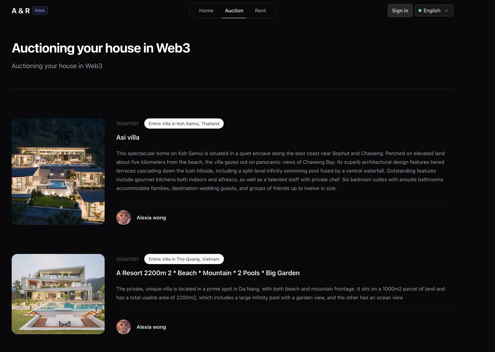
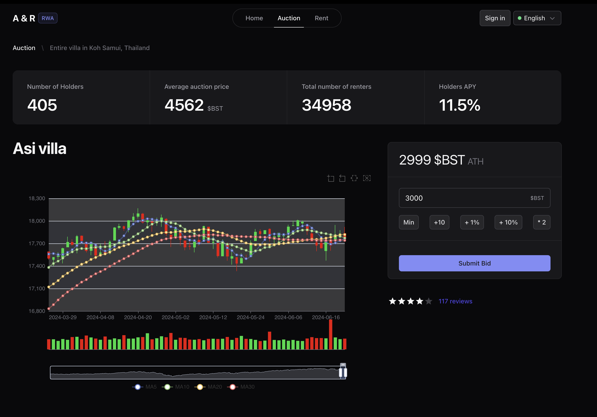
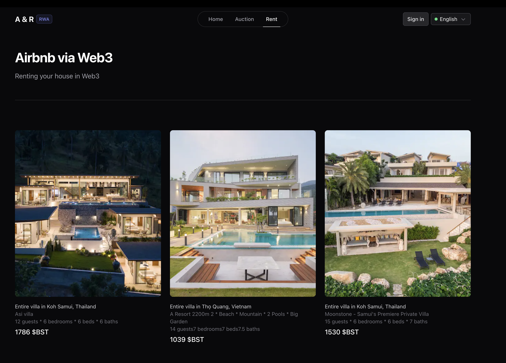
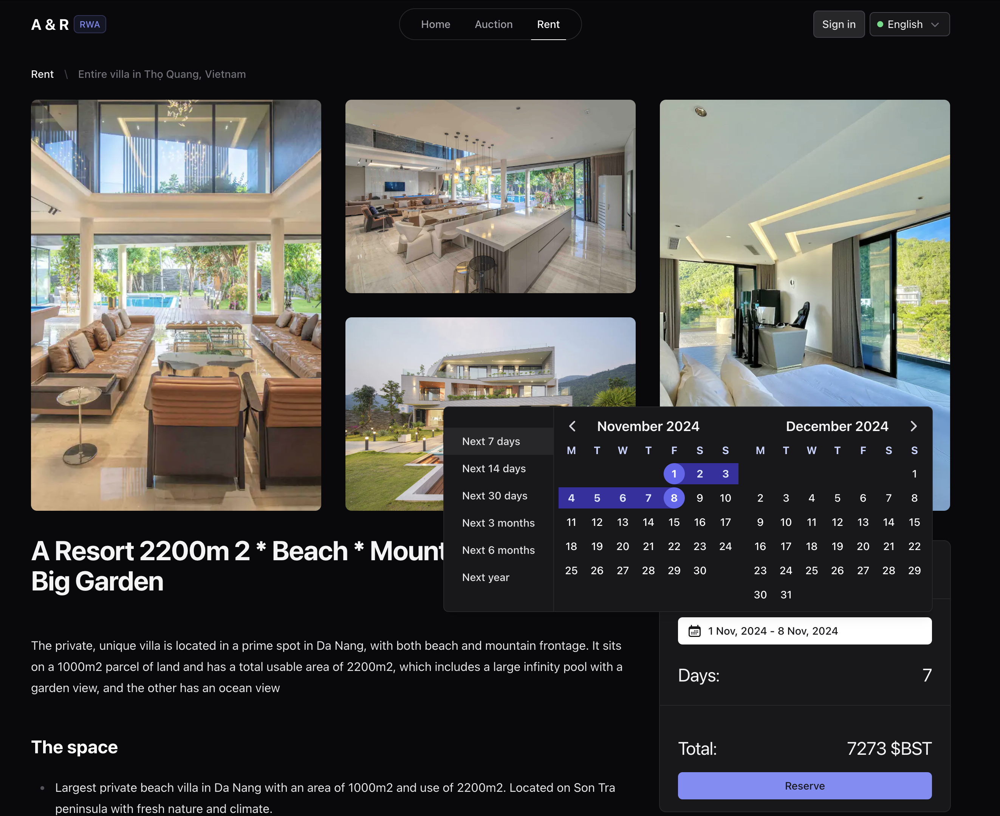

# Auction and Rent 合约代码核心部分

项目计划商用，故暂时只提交了核心代码逻辑部分，非完整的合约代码。

- [合约部署地址](https://explorer-holesky.morphl2.io/address/0xd7f8fD88193BBd31beF70C52519A71F756F0F85C)
- 在线 demo(仅界面，1105 前完成完整功能性 MVP): https://anr.rwa-wallet.com

## 核心代码逻辑

- 基于 EIP2535 标准，具有无限大合约扩展能力

### 拍卖

- 每个 tokenId 即代表一栋别墅，其创建者，即该别墅的拥有者，可以随时修改该 tokenId 的属性
- 拍卖者拍卖的是别墅的股份，每个别墅有 100 个 NFT，每个 NFT 代表一个股份
- 拍卖结束时，出价最高者获得该股份
- 每个购买者在拍卖期间发送他们的竞标到智能合约。
- 竞标包括发送资金，以便将购买者与他们的竞标绑定。
- 如果最高出价被提高，之前的出价者就可以拿回他们的竞标资金。
- 竞价期结束后，出售人可以手动调用合约：收到他们的收益。
- 拍卖终局延长 (如果在拍卖快要结束的最后几分钟内有人出价，则拍卖时间会自动延长一定的时间 (例如 5 分钟)，避免 “最后一秒出价” 的情况，并让竞拍更加激烈。

### 租赁

- 消费者可以调用 rent 函数，支付一定的金额，获得该 tokenId 的租赁权
  - 传入的参赛包括租赁日期，支付的币种地址以及对应的支付金额
- 这些收入将进入合约的收益池，并按比例分配给 tokenId 的拥有者

